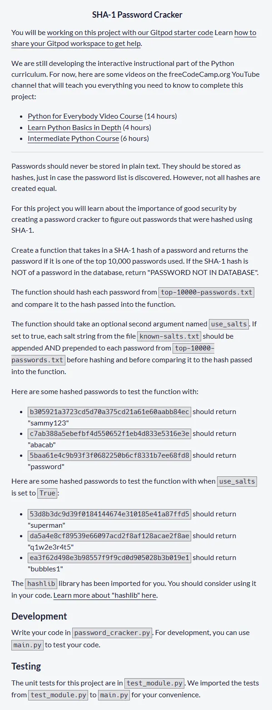
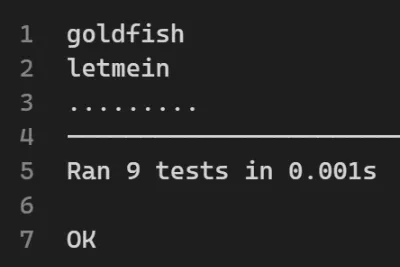

# SHA-1 Password Cracker

Código solución del cuarto proyecto requisito obligatorio para obtener la **Information Security Certification** de freecodecamp. El proyecto consiste en crear un descifrador de contraseñas en base a un hash de tipo SHA-1 en base a un listado de 10000 contraseñas almacenadas en un archivo de texto llamado `top-10000-passwords.txt` y 20 salts almacenadas también en un archivo de texto llamado `known-salts.txt`. Se debe crear una función que toma como primer parámetro el hash en formato string y como segundo parámetro toma un valor booleano. Si este valor es True, entonces debe considerar salts y en ese caso la contraseña tiene dos formas de crearse con cada salt del archivo de texto:

- salt+password
- password+salt

Ambos archivos de texto **no** los he agregado al repositorio pero es posible encontrarlos en el siguiene link: [archivos de texto](https://github.com/freeCodeCamp/boilerplate-SHA-1-password-cracker)

## Tabla de Contenidos

- [SHA-1 Password Cracker](#sha-1-password-cracker)
  - [Tabla de Contenidos](#tabla-de-contenidos)
  - [Requisitos](#requisitos)
  - [Código Solución](#código-solución)
  - [Test Unitarios Aprobados](#test-unitarios-aprobados)
  - [Proyecto Aprobado](#proyecto-aprobado)

## Requisitos



## Código Solución

Mi solución utiliza una función auxiliar que he denominado `obtener_passwords` la que construye un diccionario en casos donde no exista salts y donde exista salts, formando todas las combinaciones posibles una sola vez de modo de acceder en tiempo de complejidad O(1).

```py
import hashlib


def obtener_passwords():
    passwords_sin_salts={}
    passwords_con_salts={}

    with open("known-salts.txt") as fs:
        salts = [line.strip() for line in fs]

    with open("top-10000-passwords.txt") as fp:
        for line_password in fp:
            password_limpia = line_password.strip()
            hash_pwd = hashlib.sha1(password_limpia.encode()).hexdigest()
            passwords_sin_salts[hash_pwd] = password_limpia


            for salt in salts:
                built_with_salt1 = f'{salt}{password_limpia}'
                built_with_salt2 = f'{password_limpia}{salt}'
                hash_with_salt1 = hashlib.sha1(built_with_salt1.encode()).hexdigest()
                hash_with_salt2 = hashlib.sha1(built_with_salt2.encode()).hexdigest()
                passwords_con_salts[hash_with_salt1] = password_limpia
                passwords_con_salts[hash_with_salt2] = password_limpia

    return {"passwords_sin_salts":passwords_sin_salts,"passwords_con_salts":passwords_con_salts}


diccionario_passwords=obtener_passwords()


def crack_sha1_hash(hash, use_salts = False):
    diccionario = (
        diccionario_passwords["passwords_con_salts"]
        if use_salts
        else diccionario_passwords["passwords_sin_salts"]
    )
    return diccionario.get(hash, "PASSWORD NOT IN DATABASE")
```

## Test Unitarios Aprobados

Los test unitarios se han aprobado tal cual han sido entregados por freecodecamp:



## Proyecto Aprobado
